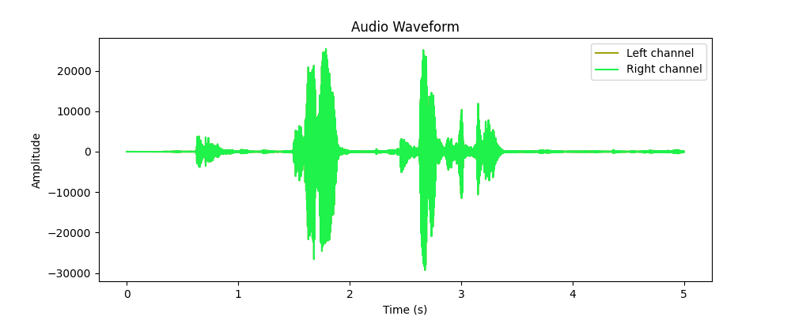

# Speech Signal Visualization 🎵

This Python script, implemented as a class-based audio processor, provides functionality for recording audio, playing it back, and visualizing the waveform using sounddevice, pygame, and matplotlib.

## Dependencies

- Python 3.x
- 🎵 [sounddevice](https://python-sounddevice.readthedocs.io/)
- 🧮 [numpy](https://numpy.org/)
- 🕹️ [pygame](https://www.pygame.org/)
- 📊 [matplotlib](https://matplotlib.org/)

Install the dependencies using:

```bash
pip install -r requirements.txt
```

Make sure to create a virtual environment and activate it before installing the dependencies.

## Usage

1. **Clone the repository:**

```bash
git clone https://github.com/ansarialireza/SpeechSignalVisualization.git
cd SpeechSignalVisualization
```

2. **Run the script:**

```bash
python audio_processor.py
```

Adjust the `duration` variable in the script to change the recording length.

## Class: AudioProcessor

```python
import sounddevice as sd
import numpy as np
import pygame
import matplotlib.pyplot as plt
import random

class AudioProcessor:
    def __init__(self, sample_rate=44100):
        # ...

    def record_audio(self, duration):
        # ...

    def play_audio(self, audio_data):
        # ...

    def plot_audio_waveform(self, audio_data, save_plot=True, plot_filename='audio_waveform.png'):
        # ...
```

### Methods

#### 1. `record_audio(duration)`

Records audio for the specified duration.

#### 2. `play_audio(audio_data)`

Plays back the recorded audio using pygame.

#### 3. `plot_audio_waveform(audio_data, save_plot=True, plot_filename='audio_waveform.png')`

Plots and optionally saves the audio waveform using matplotlib.

## Example

```python
if __name__ == "__main__":
    audio_processor = AudioProcessor()
    duration = 3
    recorded_audio = audio_processor.record_audio(duration)
    audio_processor.play_audio(recorded_audio)
    audio_processor.plot_audio_waveform(recorded_audio)
```

This script records audio for 3 seconds, plays it back, and plots the waveform.

The waveform image (`audio_waveform.png`) is saved in the same directory as the script and displayed below:



You can find the visual representation of the recorded audio waveform in this image.

## License

This project is licensed under the MIT License - see the [LICENSE](LICENSE) file for details.